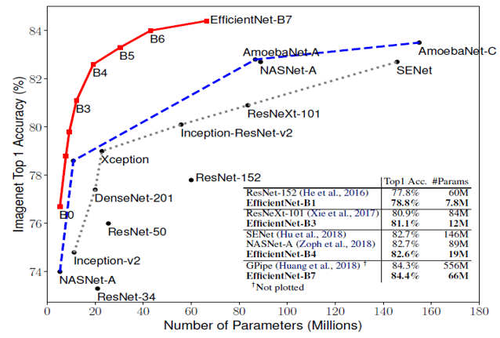
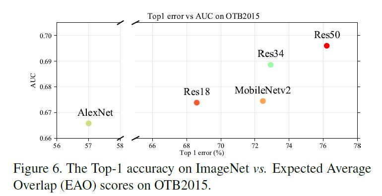

# SiamTrack

## SiamPolar 
&emsp;&emsp;在SiamRPN的基础上重新设计了网络结构,总共包括五个改进步骤:`glide vertex Bbox Regression`,`FCOS head`, 
`D_iou Loss`,`MultiDepthwise correlation`, `Polar head`, `Deep Snake`, `Search region prediction`.改进后的跟踪器网络命名为SiamGRPN, 网络的整体架构如下图所示:

### EfficientNet的使用

&emsp;&emsp;如下图所示,`Efficientnet`在目标检测领域已经验证了该特征提取器的优越性.

性能远低于EfficientN&emsp;&emsp;目标跟踪领域目前使用最先进的特征提取器是ResNet50,但是在目标检测任务上
et.如下图所示,一般在ImageNet目标检测任务上表现较好的特征提取器,在OTB目标跟踪任务上的性能也优异.因此,可以考虑使用更优异的特征提取器.同时,
也需要考虑模型大小对跟踪速度的影响.如果一个模型过大,即使跟踪的精度再高,也无法达到
实时跟踪的效果.考虑以上两点,EfficientNet是一个backbone替换的最优选择.

&emsp;&emsp; 由于 Efficient 采用搜索的框架, 训练起来对硬件的要求很高.占时放弃.....

### FCOS head(FCOS) + D_iou Loss

&emsp;&emsp;使用One stage Detector 的 FCOS head 替换 RPN head, 之后 FCOS head 
中IOU Loss 使用 D_iou loss. 代码已完成, 训练部分未进行....

### Glide Vertex Bbox Regression

&emsp;&emsp;

### PolarMask head 

### Deep Snake